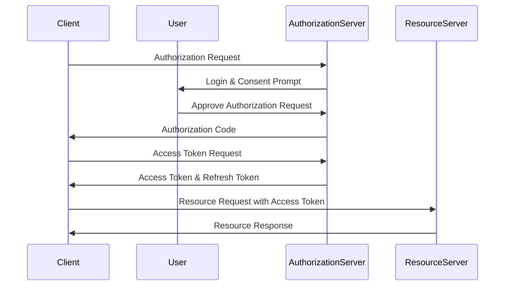
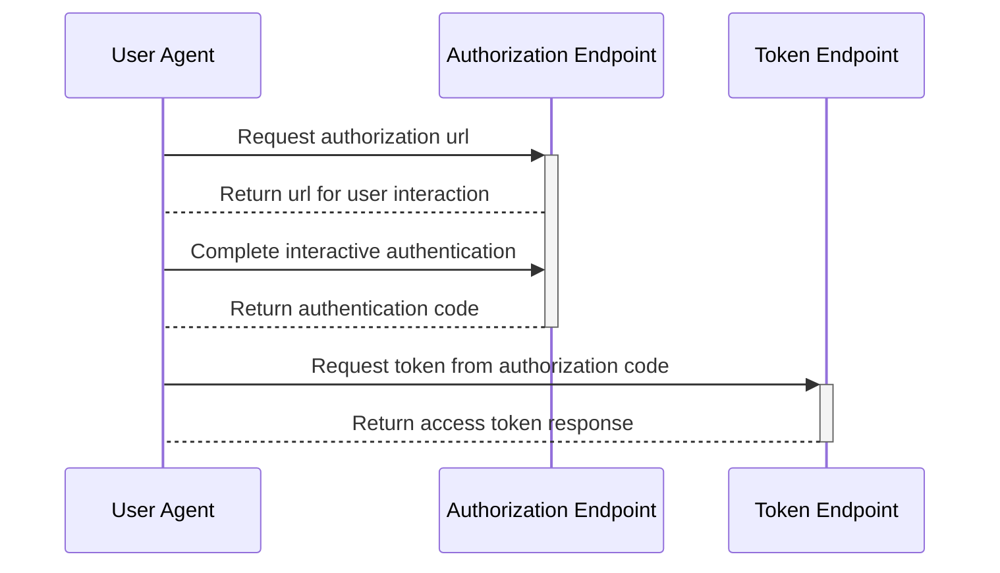

# Authorization Code Flow

The Authorization Code flow is a grant type in OAuth 2.0 that is used to obtain an access token by exchanging an authorization code with the authorization server. This flow is suitable for clients that can securely store the client secret and can interact with the resource owner's user-agent (typically a web browser).

## Flow Overview

The authorization code flow begins with the client directing the user to the authorization endpoint as defined in the [discovery document (example)](https://identity.reimers.dk/.well-known/openid-configuration) of the authentication server.

The Authorization Code flow consists of the following steps:

1. The client redirects the user to the authorization server to authorize access to protected resources.
2. The user logs in and approves the client's request.
3. The authorization server redirects the user back to the client with an authorization code.
4. The client exchanges the authorization code for an access token.
5. The client uses the access token to access the protected resources.

The following diagram shows the sequence of steps involved in the Authentication Code flow:



## Authorization Code Flow Overview

This diagram shows the complete Authorization Code flow:



The token response will contain the access token, and optionally also an id token and a refresh token. The DotAuth tool will parse the repsonse to create a json object which contains the returned values and prints it to the console.

## Example Code Request

The Authorization Code flow uses the following request parameters:

- `response_type`: The value of this parameter must be set to code.
- `client_id`: The client identifier issued by the authorization server.
- `redirect_uri`: The URI that the authorization server will redirect the user-agent to after the user has granted or denied access.
- `scope`: The scope of the access request.
- `state`: An opaque value used by the client to maintain state between the request and callback.

The following is an example of an Authorization Request:

```http
GET /authorize?response_type=code
&client_id=s6BhdRkqt3&state=xyz
&redirect_uri=https%3A%2F%2Fclient%2Eexample%2Ecom%2Fcb HTTP/1.1
Host: authorization-server.com
```

## Example Code Response

The Authorization Code flow returns the following response parameters:

- `code`: The authorization code that the client will use to obtain an access token.
- `state`: The value of the state parameter that was included in the request.

The following is an example of an Authorization Response:

```http
HTTP/1.1 302 Found
Location: https://client.example.com/cb?code=SplxlOBeZQQYbYS6WxSbIA
&state=xyz
```

## Example Access Token Request

The Authorization Code flow uses the following request parameters to obtain an access token:

- `grant_type`: The value of this parameter must be set to authorization_code.
- `code`: The authorization code obtained in the previous step.
- `redirect_uri`: The URI that was used in the previous step.

The following is an example of an Access Token Request:

```http
POST /token HTTP/1.1
Host: authorization-server.com
Content-Type: application/x-www-form-urlencoded

grant_type=authorization_code
&code=SplxlOBeZQQYbYS6WxSbIA
&redirect_uri=https%3A%2F%2Fclient%2Eexample%2Ecom%2Fcb
&client_id=s6BhdRkqt3
&client_secret=7Fj
```

## Example Access Token Response

The Authorization Code flow uses the following response parameters

- `access_token`: The access token that the client will use to access the protected resources.
- `token_type`: The type of token, which is typically set to Bearer.
- `expires_in`: The lifetime of the access token, in seconds.
- `refresh_token`: A refresh token that the client can use to obtain a new access token when the current access token expires.
- `scope`: The scope of the access token, which may be different from the scope requested by the client.

The following is an example of an Access Token Response:

```http
HTTP/1.1 200 OK
Content-Type: application/json;charset=UTF-8
Cache-Control: no-store
Pragma: no-cache

{
  "access_token": "2YotnFZFEjr1zCsicMWpAA",
  "token_type": "Bearer",
  "expires_in": 3600,
  "refresh_token": "tGzv3JOkF0XG5Qx2TlKWIA",
  "scope": "read write"
}
```
