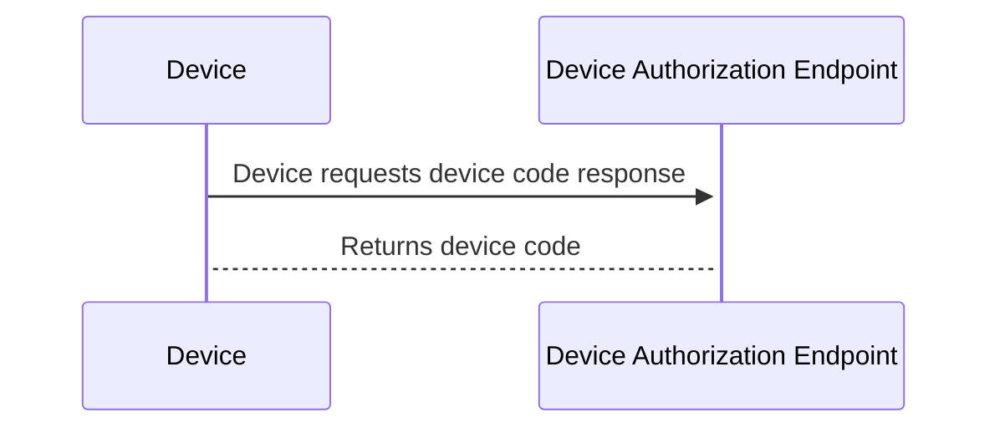
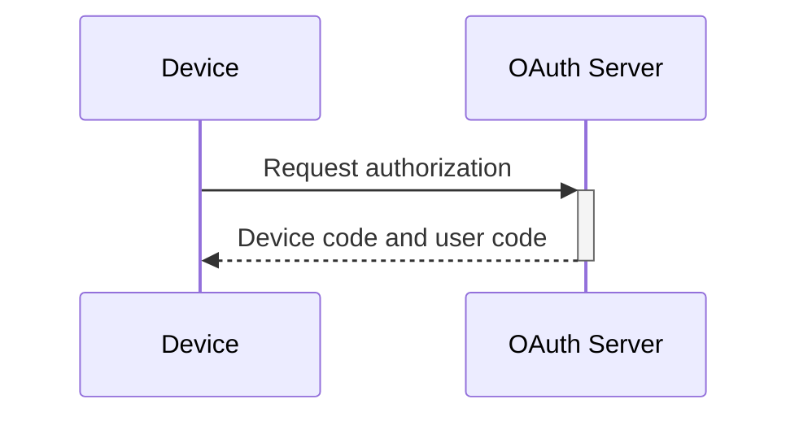
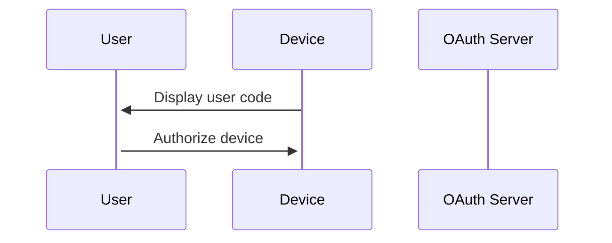
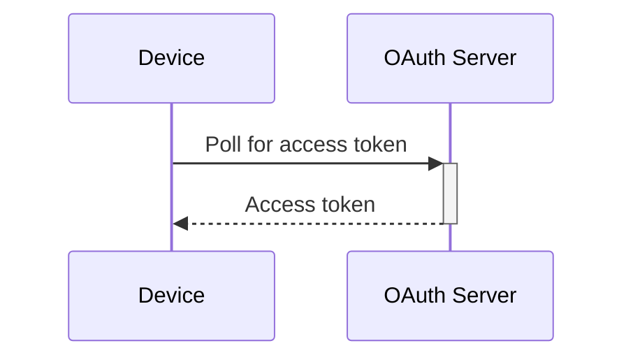
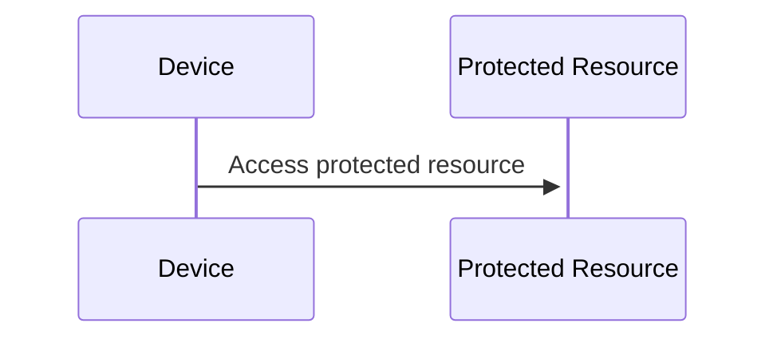
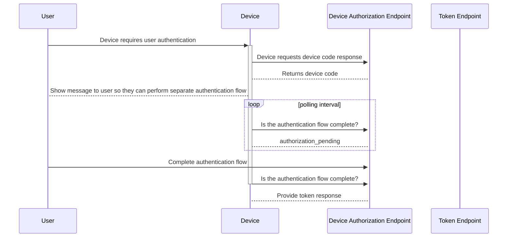

# Device Code Flow

The device code flow was added to the official OAuth flow in a separate [IETF Draft](https://tools.ietf.org/html/draft-ietf-oauth-device-flow-07).

The Device Authorization Grant flow allows devices with limited input capabilities, such as smart TVs, game consoles, and printers, to obtain user consent to access protected resources. This flow is also known as the Device Flow.

The flow consists of the following steps:

1. Device requests authorization - The device initiates the flow by requesting authorization from the OAuth server.



2. OAuth server generates device code and user code - The OAuth server generates a device code and a user code, and returns them to the device.



3. User authorizes device - The device displays the user code to the user and prompts them to authorize the device.



4. Device polls for access token - The device repeatedly polls the OAuth server, using the device code, until an access token is available.



5. Device accesses protected resource - The device uses the access token to access protected resources.



## Device Authorization Grant Flow

This diagram shows the complete Device Authorization Grant flow:



If a ```refresh token``` is provided to the device, it can use this to update the access token on expiration using the [refresh token flow](./refresh.md).

## Example Request

Here's an example request for the Device Authorization Grant flow:

```http
POST /oauth/device HTTP/1.1
Host: oauth.example.com
Content-Type: application/x-www-form-urlencoded

client_id=CLIENT_ID&scope=SCOPE
```

- `client_id` - The client identifier for the OAuth client.
- `scope` - The requested scope of the access token.

## Example Response

Here's an example response for the Device Authorization Grant flow:

```http
HTTP/1.1 200 OK
Content-Type: application/json

{
  "device_code": "DEVICE_CODE",
  "user_code": "USER_CODE",
  "verification_uri": "https://oauth.example.com/verify",
  "expires_in": 300
}
```

- `device_code` - The device code that the device uses to poll for the access token.
- `user_code` - The user code that the user enters to authorize the device.
- `verification_uri` - The URI where the user can enter the user code to authorize the device.
- `expires_in` - The duration in seconds that the device code and user code are valid for.


If a ```refresh token``` is provided to the device, it can use this to update the access token on expiration using the [refresh token flow](./refresh.md).
