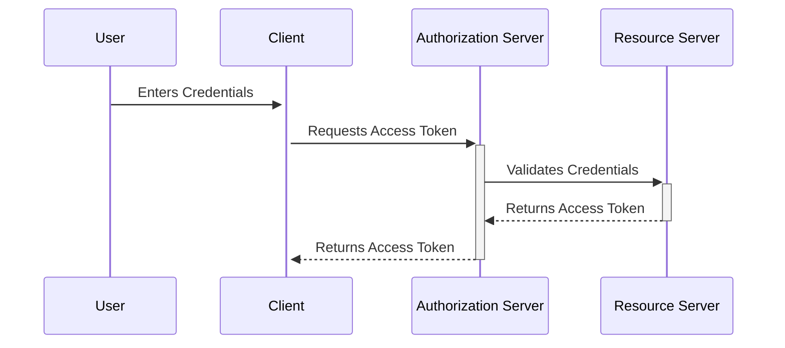

# Resource Owner Password Credentials (ROPC) Flow

The Resource Owner Password Credentials (ROPC) flow is an OAuth 2.0 flow that allows a client application to authenticate with a server using a user's credentials (username and password). This flow should only be used when other flows are not available, since it requires the client application to have access to the user's credentials.

## Flow Diagram

The following diagram illustrates the flow of the Resource Owner Password Credentials (ROPC) flow:

## Steps

1. The user enters their credentials (username and password) into the client application.
1. The client application sends a request to the authorization server with the user's credentials.
1. The authorization server validates the user's credentials with the resource server.
1. If the credentials are valid, the resource server returns an access token to the authorization server.
1. The authorization server returns the access token to the client application.
1. The client application can use the access token to make requests to the resource server on behalf of the user.

## Advantages

The ROPC flow can be useful in certain scenarios, such as legacy applications that do not support modern authentication protocols or headless applications that require automated authentication.

## Disadvantages

The ROPC flow should only be used when other flows are not available, since it requires the client application to have access to the user's credentials, which can be a security risk. Additionally, the flow does not support multifactor authentication.

## Conclusion

The ROPC flow should only be used as a last resort when other authentication flows are not available. It is important to carefully consider the security implications of using this flow and ensure that appropriate safeguards are in place to protect user credentials.
